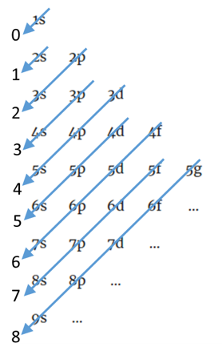
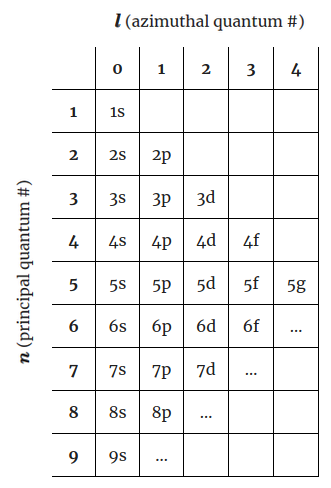
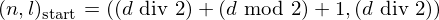
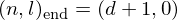
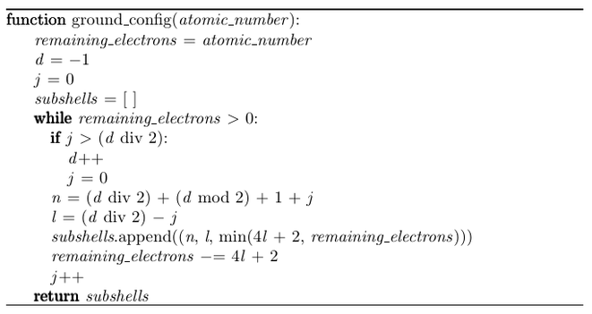

## Ground state electron configuration

In an atom's ground state, electrons fill subshells in an order determined by the
[Madelung rule](https://en.wikipedia.org/wiki/Aufbau_principle#Madelung_energy_ordering_rule),
shown below.

The diagonals are numbered in the order they're traversed, with subshells being
filled in the order 1s (diagonal 0), 2s (diagonal 1), 2p, 3s (diagonal 2),
3p, 4s (diagonal 3), 3d, 4p, 5s (diagonal 4), and so on. Writing the principal
quantum numbers <em>n</em> and azimuthal quantum numbers <em>l</em> of the
subshells:

Then, tabulating the (<em>n</em>, <em>l</em>) "coordinates" of the start and
end of each diagonal yields the following:

<table>
  <tr>
    <td>Diagonal</td>
    <td>Start</td>
    <td>End</td>
  </tr>
  <tr>
    <td>0</td>
    <td>(1, 0)</td>
    <td>(1, 0)</td>
  </tr>
  <tr>
    <td>1</td>
    <td>(2, 0)</td>
    <td>(2, 0)</td>
  </tr>
  <tr>
    <td>2</td>
    <td>(2, 1)</td>
    <td>(3, 0)</td>
  </tr>
  <tr>
    <td>3</td>
    <td>(3, 1)</td>
    <td>(4, 0)</td>
  </tr>
  <tr>
    <td>4</td>
    <td>(3, 2)</td>
    <td>(5, 0)</td>
  </tr>
  <tr>
    <td>5</td>
    <td>(4, 2)</td>
    <td>(6, 0)</td>
  </tr>
  <tr>
    <td>6</td>
    <td>(4, 3)</td>
    <td>(7, 0)</td>
  </tr>
  <tr>
    <td>7</td>
    <td>(5, 3)</td>
    <td>(8, 0)</td>
  </tr>
  <tr>
    <td>8</td>
    <td>(5, 4)</td>
    <td>(9, 0)</td>
  </tr>
  <tr>
    <td>...</td>
    <td>...</td>
    <td>...</td>
  </tr>
</table>

A pattern emerges: each diagonal <em>d</em> starts at (<em>n</em>, <em>l</em>)
= ((<em>d</em> div 2) + (<em>d</em> mod 2) + 1, (<em>d</em> div 2))
and ends at (<em>n</em>, <em>l</em>) = (<em>d</em> + 1, 0).

Further, each each diagonal contains (<em>d</em> div 2) subshells. Obtaining
the ground state electron configuration then becomes a matter of keeping track
of the current diagonal, introducing a variable <em>j</em> to track the current
element of the current diagonal (0 ≤ <em>j</em> ≤ (<em>d</em> div 2)). When
<em>j</em> exceeds the number of elements in the current diagonal, the diagonal
is incremented and <em>j</em> is reset to 0. During each iteration, the number
of electrons that can fill the current subshell (which is related to the
azimuthal quantum number <em>l</em> and is equal to 4<em>l</em> + 2) is
subtracted from the number of remaining electrons that have not been placed
into subshells. If the capacity of the current subshell is greater than the
number of remaining electrons, the number of remaining electrons is placed
into the current subshell and the routine terminates. At the end of the
iteration, a tuple containing the subshell's principal quantum number <em>n</em>,
azimuthal quantum number <em>l</em>, and the number of electrons in the
subshell is added to a list, which the function ultimately returns.
The procedure is shown below in pseudocode.

## Atomic number of the <em>k</em>th noble gas

First, we number the noble gases with an index <em>k</em>, where <em>k</em> = 1
refers to helium, <em>k</em> = 2 refers to neon, <em>k</em> = 3 refers to argon,
and so on. The table below lists this, along with the atomic number <em>Z</em>
of each noble gas.

The table also contains a row labeled <em>ΔZ</em>, a quantity that represents 
the difference between the atomic number of an element <em>k</em> and the
atomic number of the previous element <em>k</em> – 1. For example, radon
(<em>k</em> = 6) has atomic number 86, and the preceding element in the
sequence, xenon (<em>k</em> = 5) has atomic number 54. 86 – 54 = 32, thus, 
<em>ΔZ</em> for radon is 32.

Carefully note the sequence of <em>ΔZ</em> values: 2, 8, 8, 18, 18, 32, 32.
This sequence is not arbitrary and is related to the capacities of the electron
shells. Shells are described by the principal quantum number <em>n</em>, where
<em>n</em> = 1 refers to the first shell, <em>n</em> = 2 refers to the second
shell, and so on. Each shell has <em>n</em> possible subshells—that is, the
first shell (<em>n</em> = 1) has one subshell, (<em>n</em> = 2) has up to two
subshells, the third shell (<em>n</em> = 3) has up to three subshells, and so
on. Subshells are described by the azimuthal quantum number <em>l</em>,
numbered from <em>l</em> = 0 to <em>l</em> = <em>n</em> - 1. Each subshell can
hold up to 4<em>l</em> + 2 electrons. The table below displays the subshells
(and their capacities) for the first five shells.

The first shell (<em>n</em> = 1) has one subshell and can hold a total of 2
electrons. The second shell (<em>n</em> = 2) has two subshells containing up to
2 + 6 = 8 electrons. The third shell (<em>n</em> = 3) has three subshells
containing up to 2 + 6 + 10 = 18 electrons. The fourth shell (<em>n</em> = 4)
has four subshells containing up to 2 + 6 + 10 + 14 = 32 electrons. In other
words, each shell can hold up to 2<em>n</em>2 electrons.
Note that these are the same as the <em>ΔZ</em> values.

Observe that the elements can be grouped into pairs with identical
<em>ΔZ</em> values. Referring to the pairs with <em>p</em>, where
<em>p</em> = 1 contains <em>k</em> = 0, 1 (<em>ΔZ</em> = 2), <em>p</em> = 2
contains <em>k</em> = 2, 3 (<em>ΔZ</em> = 8), etc., it can be seen that
<em>ΔZ</em> for a given pair <em>p</em> is equal to the number of electrons
in each shell, i.e., 2<em>p</em>2:

Also observe that the atomic number <em>Z</em> of any element in the table is
equal to the sum of all the <em>ΔZ</em> values up to and including that
element. For example, the atomic number for xenon (<em>k</em> = 5) is equal to
2 + 8 + 8 + 18 + 18 = 54. In other words, each pair adds
2<em>ΔZp</em> to the total (with the exception of the first pair,
since <em>k</em> = 0 isn't an element and doesn't contribute any electrons).
Then the sum of the first <em>P</em> pairs is given by the following sum:

where we subtract 2 to account for <em>k</em> = 0. From
[Faulhaber's formula](https://en.wikipedia.org/wiki/Faulhaber%27s_formula),
the sum of the quadratic sequence above can be rewritten as a cubic polynomial:

Then, the atomic number for a given <em>k</em> can be obtained by:

1) determining the pair <em>p</em> to which <em>k</em> belongs.
2) computing the sum of all previous pairs (up to <em>p</em> - 1).
3) computing <em>ΔZp</em> for the current pair.
4) adding either <em>ΔZp</em> to the sum from step 2 (if
  <em>k</em> is the first element of pair <em>p</em>) or
  2<em>ΔZp</em> (if <em>k</em> is the second element of
  pair <em>p</em>).

The pair <em>p</em> can be obtained from the integer division of <em>k</em>
into 2:

Then the final equation for the atomic number <em>Zk</em> of noble
gas <em>k</em> in the sequence is:

where `div` refers to integer division and `mod` to modulo division.
