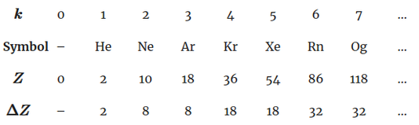

# chem
Miscellaneous chemistry-related programs

## Atomic number of the <em>k</em>th noble gas

First, we number the noble gases with an index <em>k</em>, where <em>k</em>=1
refers to helium, <em>k</em>=2 refers to neon, <em>k</em>=3 refers to argon,
and so on. The table below lists this, along with the atomic number <em>Z</em>
of each noble gas.

The table also contains a row labeled <em>ΔZ</em>, a quantity that represents 
the difference between the atomic number of an element <em>k</em> and the
atomic number of the previous element <em>k</em>–1. For example, radon
(<em>k</em>=6) has atomic number 86, and the preceding element in the
sequence, xenon (<em>k=5</em>) has atomic number 54. 86 – 54 = 32, thus, 
<em>ΔZ</em> for radon is 32.

Carefully note the sequence of <em>ΔZ</em> values: 2, 8, 8, 18, 18, 32, 32.
This sequence is not arbitrary and is related to the capacities of the electron
shells. Shells are described by the principal quantum number <em>n</em>, where
<em>n</em>=1 refers to the first shell, <em>n</em>=2 refers to the second
shell, and so on. Each shell has <em>n</em> possible subshells—that is, the
first shell (<em>n</em>=1) has one subshell, (<em>n</em>=2) has up to two
subshells, the third shell (<em>n</em>=3) has up to three subshells, and so
on. Subshells are described by the azimuthal quantum number <em>l</em>,
numbered from <em>l</em>=0 to <em>l</em>=<em>n</em>-1. Each subshell can hold
up to 4<em>l</em> + 2 electrons. The table below displays the subshells (and
their capacities) for the first five shells.

The first shell (<em>n</em>=1) has one subshell and can hold a total of 2
electrons. The second shell (<em>n</em>=2) has two subshells containing up to
2 + 6 = 8 electrons. The third shell (<em>n</em>=3) has three subshells
containing up to 2 + 6 + 10 = 18 electrons. The fourth shell (<em>n</em>=4)
has four subshells containing up to 2 + 6 + 10 + 14 = 32 electrons. Note that
these are the same as the <em>ΔZ</em> values.

